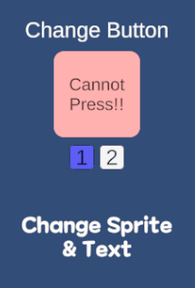
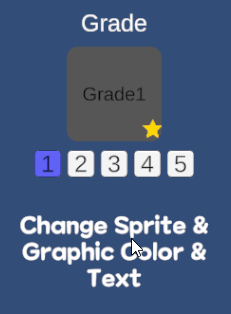

# 이승진 포트폴리오

## UITypeSetting
UI의 다양한 컴포넌트들을 원하는 모양으로 세팅 후 아이디를 부여하여 코드상에서 한 번에 호출

---



텍스트와 이미지를 변경하는 것이 아니라 미리 저장해둔 세팅을 bool값으로 불러오는 모습
```csharp
private UITypeSetting _test1Type;

// 1번 토글
_test1Type.Active(true);

// 2번 토글
_test1Type.Active(false);
```

---



등급에 맞는 이미지들을 세팅 후 int값으로 UI 변경
```csharp
private UITypeSetting _gradType;
public void OnChangeGradeToggle(int grade) {
    _gradType.Active(grade);
}
```