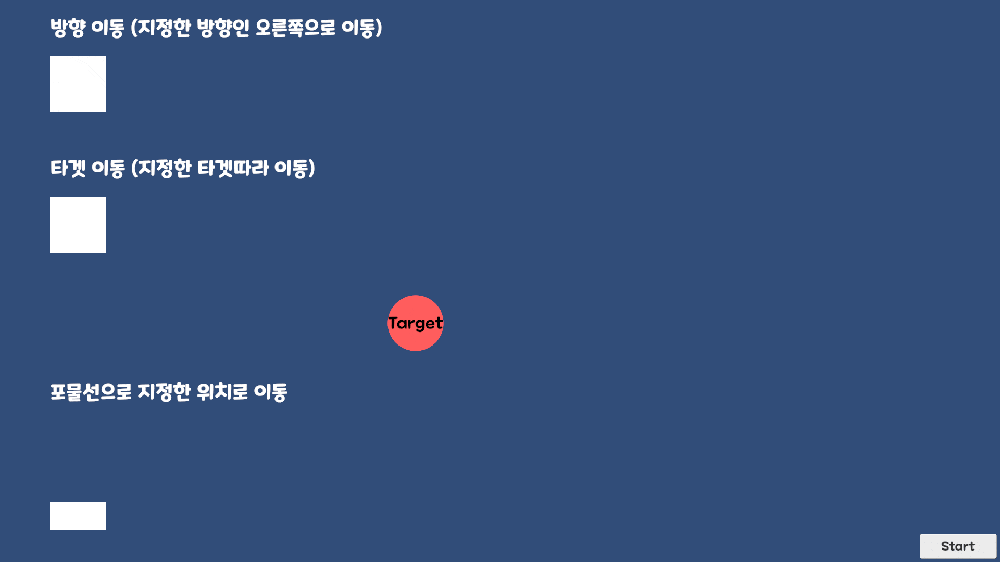

## MoveComponent
오브젝트의 이동 방식을 컴포넌트로 분리하여 방향, 타겟, 포물선 이동을 간단하게 설정<br>
각 이동 컴포넌트는 `Move()`로 이동을 시작하고 `Stop()`으로 정지

---

### Direction
지정한 방향으로 계속 이동
```csharp
private MoveComponentDirection _moveComponentDirection;

_moveComponentDirection.SetDirection(Vector2.right);
_moveComponentDirection.Move();
```

---

### Target
지정한 타겟을 향해 이동하며 가까워지면 정지
```csharp
private MoveComponentTarget _moveComponentTarget;
private Transform _target;

_moveComponentTarget.SetTarget(_target);
_moveComponentTarget.Move();
```

---

### Parabola
지정한 위치까지 포물선으로 이동
```csharp
private MoveComponentParabola _moveComponentParabola;
private Vector2 _destination;

_moveComponentParabola.SetDestination(_destination);
_moveComponentParabola.Move();
```

---

### Example
여러 이동 컴포넌트를 리스트에 등록한 뒤 시작 위치로 초기화하고 한 번에 실행
```csharp
for (int i = 0; i < _moveComponents.Count; i++) {
    _moveComponents[i].transform.position = _startPositions[i];
    _moveComponents[i].enabled = true;
    _moveComponents[i].Move();
}
```
