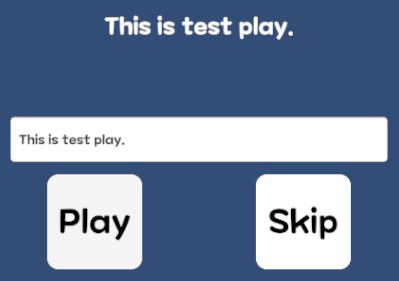
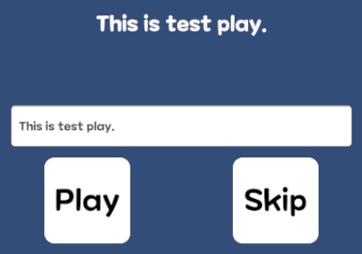
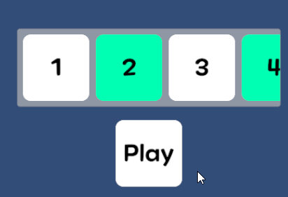

## UIDirection
UI에서 사용하는 여러가지 연출들을 만들어둔 컴포넌트<br>
아래 코드를 상속받아 여러가지 연출을 한번에 관리<br>
스킵 및 종료 후 콜백 존재

<details>
<summary> 코드 보기 </summary>

```csharp
public class UIDirection : MonoBehaviour {
	[SerializeField] protected bool _playOnEnabled;
	[SerializeField] protected UnityEvent _endCb;

	protected CancellationTokenSource _cancellationToken;

	public bool IsPlaying { get; protected set; }

	private void OnEnable() {
		if (_playOnEnabled) {
			Play();
		}
	}

	public virtual void Play() {
		IsPlaying = true;
		_cancellationToken = new CancellationTokenSource();
		PlayAsync().Forget();
	}

	protected virtual async UniTask PlayAsync() {
		await UniTask.CompletedTask;
	}

	public virtual void Skip() {
		if (!IsPlaying) {
			return;
		}

		IsPlaying = false;
		_endCb?.Invoke();
		if (_cancellationToken != null) {
			_cancellationToken.Cancel();
			_cancellationToken.Dispose();
			_cancellationToken = null;
		}
	}

	public void AddEndCb(UnityAction callback) {
		if (_endCb == null) {
			_endCb = new UnityEvent();
		}

		_endCb.AddListener(callback);
	}

	public void RemoveEndCb(UnityAction callback) {
		if (_endCb == null) {
			return;
		}

		_endCb.RemoveListener(callback);
	}
}
```
</details>

---
### 텍스트 타이핑 연출
저장해둔 텍스트를 하나씩 출력하는 연출




```csharp
_text.text = string.Empty;
foreach (char oneChar in _textToPlay) {
	_text.text += oneChar;

	await UniTask.WaitForSeconds(_sequentialDelay, cancellationToken: _cancellationToken.Token);
}
```
스킵 가능



---

### 스크롤 아이템 연출
스크롤 내부의 아이템이 하나씩 출력되는 연출<br>
아이템 보상 획득 등에서 사용



```csharp
foreach (Transform childTransform in _childTransformArr) {
	childTransform.gameObject.SetActive(false);
}

foreach (Transform childTransform in _childTransformArr) {
	childTransform.gameObject.SetActive(true);
	if (_isMoveToLast) {
		if (_scrollRect.vertical) {
			_scrollRect.verticalNormalizedPosition = 1f;
		}

		if (_scrollRect.horizontal) {
			_scrollRect.horizontalNormalizedPosition = 1f;
		}
	}

	await UniTask.WaitForSeconds(_sequentialDelay, cancellationToken: _cancellationToken.Token);
}

IsPlaying = false;
_endCb?.Invoke();
```