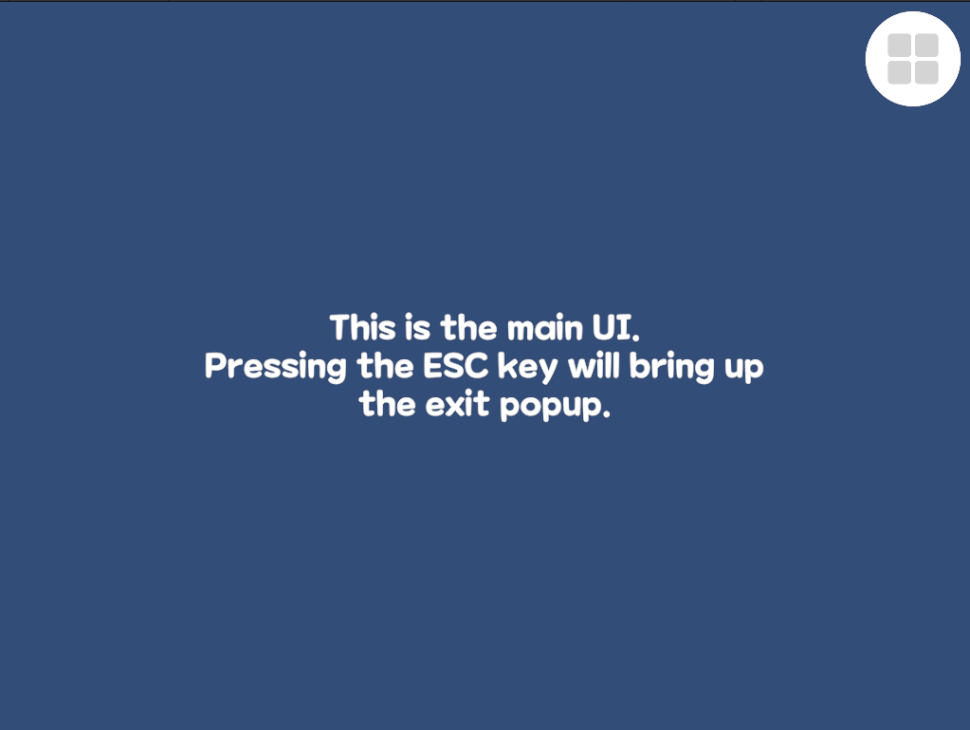
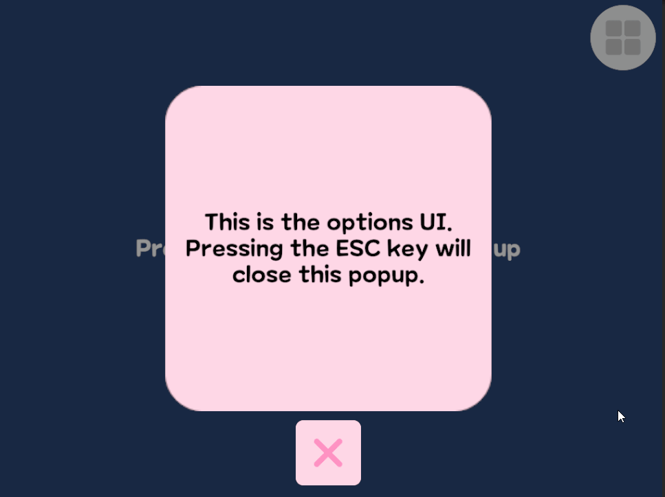

## UIManager
UI 열기, 닫기, 뒤로 가기 등의 기능을 관리하는 매니저.

### UIBase
UI오브젝트가 기본적으로 상속받는 클래스

<details>
<summary> 코드 보기 </summary>

```csharp
public class UIBase : MonoBehaviour {
	public UIType uiType;
	public BackButtonType backButtonType;

	public virtual void Init() { }

	public virtual void Show(Dictionary<string, object> param = null) {
		gameObject.SetActive(true);
	}

	public virtual void AfterShow() { }

	public virtual void Hide() {
		gameObject.SetActive(false);
	}

	public virtual void OnBack() {
		UIManager.Hide(uiType);
	}

	public virtual void Refresh() { }
}
```
</details>

---
### UI 열기
Show 함수를 통해 UI를 열기<br>
가장 마지막에 연 UI가 최상단에 뜨도록 조정<br>
열린 UI들은 List에 저장



<details>
<summary> 코드 보기 </summary>

```csharp
public static async void Show(UIType uiType, Dictionary<string, object> param = null) {
	_showWaitQueue.Add(uiType);
	if (!_uiBaseDic.ContainsKey(uiType)) {
		await Load(uiType);
	}

	await UniTask.WaitUntil(() => _showWaitQueue.First().Equals(uiType));
	var uiBase = _uiBaseDic.GetValueOrDefault(uiType);
	uiBase.transform.SetAsLastSibling();
	uiBase.Show(param);
	if (_showUIList.Contains(uiType)) {
		_showUIList.Remove(uiType);
	}

	_showUIList.Add(uiType);

	await UniTask.WaitUntil(() => uiBase.gameObject.activeInHierarchy);
	uiBase.AfterShow();
	_showWaitQueue.Remove(uiType);
}
```
</details>

---

### UI 종료
현재 열려있는 UI들 중 타입을 받아서 UI를 종료

<details>
<summary> 코드 보기 </summary>

```csharp
public static void Hide(UIType uiType) {
	var uiBase = _uiBaseDic.GetValueOrDefault(uiType);
	if (uiBase is null) {
		return;
	}

	uiBase.Hide();
	_showUIList.Remove(uiType);
}
```
</details>

---

### 뒤로가기 버튼
esc 버튼같은 뒤로가기 기능 작동 시 가장 최근에 열린 UI를 종료 (저장된 List의 마지막 UI)<br>
별도로 타입을 지정해 UI를 종료하는 것이 아닌 추가 기능이 작동하도록 구현 가능<br>



<details>
<summary> 코드 보기 </summary>

```csharp
public static void OnBack(UIType uiType) {
	UIBase uiBase = _uiBaseDic.GetValueOrDefault(uiType);
	if (uiBase is null) {
		return;
	}

	switch (uiBase.backButtonType) {
		case BackButtonType.Close:
			uiBase.OnBack();
			break;
		case BackButtonType.GameExit:
			Show(UIType.GameExit);
			break;
	}
}
```
</details>